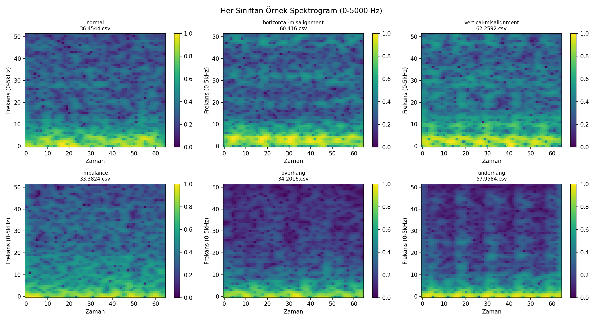

# TinyML-Based Predictive Maintenance System

A real-time predictive maintenance system that uses vibration data and deep learning to classify machine operating conditions. The project combines signal processing, CNN-based classification, TinyML deployment on an ESP32-S3, and real-time monitoring through MQTT and Firebase.

This project was developed as my Computer Engineering graduation project.

## Overview

The system analyzes three-axis vibration data collected from an MPU6050 accelerometer to identify different machine conditions.

Seven operating conditions are classified:

- Normal
- Horizontal Misalignment
- Vertical Misalignment
- Imbalance
- Ball Fault
- Cage Fault
- Outer Race Fault

The project includes both a higher-capacity EfficientNet-B0 model for PC-based evaluation and a lightweight TinyCNN model designed for deployment on an ESP32-S3.

## System Pipeline

```text
Vibration Data
      ↓
Signal Preprocessing
      ↓
STFT Spectrogram Generation
      ↓
CNN Classification
      ↓
TinyCNN Model
      ↓
ONNX → TensorFlow → INT8 TFLite
      ↓
ESP32-S3 Edge Inference
      ↓
MQTT Communication
      ↓
Real-Time Monitoring
```

## Technologies

**Machine Learning & Signal Processing**
- Python
- PyTorch
- TensorFlow / TensorFlow Lite
- NumPy
- SciPy
- Scikit-learn
- EfficientNet-B0
- TinyCNN
- STFT

**Embedded Systems**
- ESP32-S3
- MPU6050 accelerometer
- TensorFlow Lite for Microcontrollers
- Arduino / C++

**Communication & Monitoring**
- MQTT
- Mosquitto
- Flask
- Flask-SocketIO
- Firebase Realtime Database

## Data Preprocessing

The vibration signals are processed before model training using:

- Three-axis vibration channels
- Sliding windows
- Signal normalization
- Short-Time Fourier Transform (STFT)
- Log-scaled spectrograms
- Image resizing for CNN input

The generated spectrograms represent vibration characteristics in the time-frequency domain.



## Models

### EfficientNet-B0

EfficientNet-B0 was used as the higher-capacity CNN model for vibration-based condition classification.

Transfer learning and class balancing techniques were used during training.

### TinyCNN

A custom lightweight CNN was developed for resource-constrained edge deployment.

The model consists of three convolutional blocks followed by a fully connected classifier and produces predictions for seven machine conditions.

The trained PyTorch model is exported to ONNX and subsequently converted to TensorFlow Lite for embedded deployment.

## Edge Deployment

The TinyCNN model is converted through the following deployment pipeline:

```text
PyTorch
  ↓
ONNX
  ↓
TensorFlow SavedModel
  ↓
INT8 TensorFlow Lite
  ↓
C Header
  ↓
ESP32-S3
```

The generated model is integrated into the ESP32 application for local inference.

The ESP32-S3 reads vibration measurements from the MPU6050 and publishes sensor data and prediction results through MQTT.

## Real-Time Monitoring

The project also contains a monitoring application built with Flask and Socket.IO.

The dashboard can display:

- Real-time X, Y and Z vibration measurements
- Predicted machine condition
- Prediction confidence
- Prediction history

Prediction data can also be stored in Firebase Realtime Database.

## Repository Structure

```text
tinyml-predictive-maintenance/
│
├── assets/
│   └── sample_spectrograms.png
│
├── esp32/
│   ├── tinyml_esp32.ino
│   ├── tinyml_model.h
│   └── secrets.example.h
│
├── monitoring/
│   ├── dashboard.py
│   └── mqtt_receiver.py
│
├── src/
│   ├── preprocess_vibration_data.py
│   ├── train_efficientnet.py
│   ├── evaluate_file_based.py
│   ├── train_tinycnn.py
│   └── convert_to_tflite.py
│
├── .gitignore
└── README.md
```

## Configuration

Local credentials and environment-specific files are intentionally excluded from the repository.

For ESP32 Wi-Fi and MQTT configuration, copy:

```text
esp32/secrets.example.h
```

as:

```text
esp32/secrets.h
```

and replace the placeholder values with your own local configuration.

The `secrets.h` file is excluded from version control.

## Dataset

This project uses the MAFAULDA (Machinery Fault Database) vibration dataset, which contains measurements representing normal operating conditions and different mechanical fault conditions.

For this project, the vibration data was organized into seven classification categories:

- Normal
- Horizontal Misalignment
- Vertical Misalignment
- Imbalance
- Ball Fault
- Cage Fault
- Outer Race Fault

The raw dataset and generated preprocessing files are not included in this repository due to their size.

The original dataset source and download link will be added to the documentation.

## Author

**Fatma Sıla Yurdakul**  